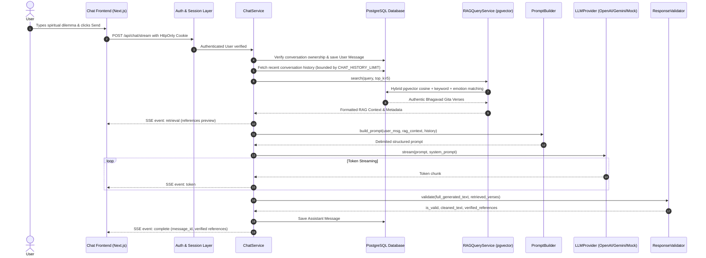

# GitaMitra Chat Architecture (Step 5)

This document describes the architectural flow, component boundaries, and security model of the Gita-grounded conversational chatbot system in GitaMitra.

---

## 1. End-to-End Request Flow



---

## 2. Core Components

### 2.1. LLM Provider Abstraction (`app/llm/base.py`)
Decouples application logic from specific AI vendors:
- **`LLMProvider`**: Base abstract interface with `generate(...)` and `stream(...)`.
- **`OpenAIProvider`**: Streaming integration with OpenAI-compatible chat completion endpoints.
- **`GeminiProvider`**: Streaming integration with Google Gemini REST API.
- **`MockProvider`**: Built-in intelligent scripture-grounded synthesizer that strictly quotes retrieved verses from RAG, detects Hindi/English, and streams token-by-token. Ensures tests and local setups operate 100% reliably out of the box without requiring external API keys.
- **`get_llm_provider()`** (`app/llm/factory.py`): Dynamically resolves provider based on `LLM_PROVIDER` and available keys (`OPENAI_API_KEY`, `GEMINI_API_KEY`).

### 2.2. Dedicated Chat Service (`app/services/chat.py`)
Coordinates conversation persistence, bounded history retrieval, RAG integration, LLM streaming, response validation, and SSE event dispatch. All business logic is strictly encapsulated outside the FastAPI route handlers.

### 2.3. Bounded Conversation History
To prevent token bloat and hallucination drift, `CHAT_HISTORY_LIMIT` (default: 6) limits the number of recent messages fed to the prompt builder. Older history is preserved in PostgreSQL for user review, but not forwarded to the model.

### 2.4. Scripture Grounding & Response Validation (`app/llm/validator.py`)
Enforces the core rule:
- Any cited verse (e.g. `2.47`) must exist in the RAG retrieval set.
- Unretrieved citations are detected, logged, and sanitized.
- False claims of being Shri Krishna or a deity are stripped.
- Harmful religious or safety advice is rejected.
- Verified reference objects are constructed directly from authoritative database data.

### 2.5. Multi-User Security & Isolation
Every operation on `/api/conversations` and `/api/chat` enforces:
```python
stmt = select(Conversation).where(
    Conversation.id == conversation_id,
    Conversation.user_id == current_user.id
)
```
User A can never read, modify, or inject messages into User B's conversations.
